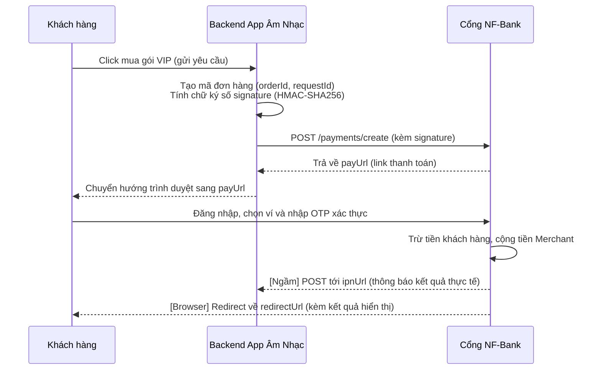

# HƯỚNG DẪN TÍCH HỢP CỔNG THANH TOÁN NF-BANK (SANDBOX)

Tài liệu này hướng dẫn cách tích hợp cổng thanh toán NF-Bank vào App Âm Nhạc (Music App).

---

## 1. THÔNG SỐ CẤU HÌNH (CREDENTIALS)

Vui lòng đặt các thông số sau vào cấu hình môi trường hoặc file `.env` ở **Backend** của App Âm Nhạc:

```env
# Cấu hình Cổng thanh toán NF-Bank Sandbox
NFBANK_API_URL=https://huddling-spouse-unnamable.ngrok-free.dev/api/v1
NFBANK_PARTNER_CODE=NFBANK_PROD_OR_TEST_ID
NFBANK_ACCESS_KEY=your_nfbank_access_key_here
NFBANK_SECRET_KEY=your_nfbank_secret_key_here
```
> [!WARNING]
> Tuyệt đối không đặt `NFBANK_SECRET_KEY` ở Frontend của ứng dụng để tránh bị lộ khóa bí mật cho phép ký giả mạo giao dịch. 

---

## 2. QUY TRÌNH THANH TOÁN



---

## 3. CHI TIẾT TÍCH HỢP API

### BƯỚC 1: KHỞI TẠO ĐƠN HÀNG VÀ LẤY LINK THANH TOÁN (POST `/payments/create`)

* **Endpoint:** `${NFBANK_API_URL}/payments/create`
* **Method:** `POST`
* **Headers:** `Content-Type: application/json`

#### Cấu trúc Payload gửi đi (Body JSON):
```json
{
  "partnerCode": "NFBANK_PROD_OR_TEST_ID",
  "accessKey": "your_nfbank_access_key_here",
  "requestId": "REQ_1234567890",
  "amount": 50000,
  "orderId": "MUSIC_APP_1234567890",
  "orderInfo": "Thanh toan VIP Premium Music App (1 Thang)",
  "redirectUrl": "https://your-music-app.com/payment-result",
  "ipnUrl": "https://your-music-app-api.com/webhooks/nfbank",
  "extraData": "{\"userId\":123,\"packageName\":\"premium_monthly\"}",
  "signature": "chuỗi_ký_số_hmac_sha256"
}
```

#### Quy tắc tính chữ ký số `signature`:
1. Ghép các trường thông tin thành một chuỗi raw string theo thứ tự bảng chữ cái của tên trường (ngăn cách bằng ký tự `&`):
   ```text
   accessKey=[value]&amount=[value]&extraData=[value]&ipnUrl=[value]&orderId=[value]&orderInfo=[value]&partnerCode=[value]&redirectUrl=[value]&requestId=[value]
   ```
2. Sử dụng khóa bí mật `NFBANK_SECRET_KEY` để ký chuỗi raw string trên bằng thuật toán **HMAC-SHA256** để tạo ra chuỗi signature ở dạng Hexadecimal.

#### Next.js / Node.js Code mẫu để gọi API khởi tạo đơn hàng:
```javascript
const crypto = require('crypto');

async function createPayment() {
  const amount = 50000;
  const orderId = `MUSIC_${Date.now()}`;
  const requestId = `REQ_${Date.now()}`;
  const orderInfo = 'Thanh toan VIP Premium Music App';
  const redirectUrl = 'https://your-music-app.com/payment-result';
  const ipnUrl = 'https://your-music-app-api.com/webhooks/nfbank';
  const extraData = JSON.stringify({ userId: 123 });

  // 1. Tạo chuỗi ký số
  const rawSignature = [
    `accessKey=${process.env.NFBANK_ACCESS_KEY}`,
    `amount=${amount}`,
    `extraData=${extraData}`,
    `ipnUrl=${ipnUrl}`,
    `orderId=${orderId}`,
    `orderInfo=${orderInfo}`,
    `partnerCode=${process.env.NFBANK_PARTNER_CODE}`,
    `redirectUrl=${redirectUrl}`,
    `requestId=${requestId}`
  ].join('&');

  // 2. Tính signature
  const signature = crypto
    .createHmac('sha256', process.env.NFBANK_SECRET_KEY)
    .update(rawSignature)
    .digest('hex');

  // 3. Gửi POST Request
  const response = await fetch(`${process.env.NFBANK_API_URL}/payments/create`, {
    method: 'POST',
    headers: { 'Content-Type': 'application/json' },
    body: JSON.stringify({
      partnerCode: process.env.NFBANK_PARTNER_CODE,
      accessKey: process.env.NFBANK_ACCESS_KEY,
      requestId,
      amount,
      orderId,
      orderInfo,
      redirectUrl,
      ipnUrl,
      extraData,
      signature
    })
  });

  const data = await response.json();
  if (response.ok && data.resultCode === 0) {
    // Chuyển hướng người dùng sang link thanh toán
    console.log("🔗 Chuyển hướng người dùng sang:", data.payUrl);
  }
}
```

---

### BƯỚC 2: XỬ LÝ KẾT QUẢ THANH TOÁN (IPN WEBHOOK)

Khi khách hàng hoàn tất thanh toán (thành công hoặc thất bại), NF-Bank sẽ bắn một request `POST` ngầm tới endpoint `ipnUrl` đã được cấu hình ở Bước 1.

* **Method:** `POST`
* **Headers:** `Content-Type: application/json`

#### Cấu trúc Payload nhận được (JSON):
```json
{
  "partnerCode": "NFBANK_PROD_OR_TEST_ID",
  "orderId": "MUSIC_APP_1234567890",
  "requestId": "REQ_1234567890",
  "amount": 50000,
  "orderInfo": "Thanh toan VIP Premium Music App (1 Thang)",
  "orderType": "nfbank_gateway",
  "transId": 12,
  "resultCode": 0,
  "message": "Giao dịch thành công",
  "payType": "payment",
  "responseTime": 1782200772587,
  "extraData": "{\"userId\":123}",
  "signature": "chuỗi_ký_số_hmac_sha256_phản_hồi"
}
```
> [!IMPORTANT]
> `resultCode = 0` nghĩa là giao dịch thanh toán thành công, tiền đã thực trừ và chuyển về tài khoản ví thụ hưởng của đối tác. Các giá trị khác 0 là thất bại.

#### Code mẫu xử lý và xác thực chữ ký của Webhook (IPN):
```javascript
app.post('/webhooks/nfbank', (req, res) => {
  const data = req.body;

  // 1. Tạo chuỗi ký đối soát từ payload nhận được
  const rawSignature = [
    `amount=${data.amount}`,
    `extraData=${data.extraData}`,
    `message=${data.message}`,
    `orderId=${data.orderId}`,
    `partnerCode=${data.partnerCode}`,
    `requestId=${data.requestId}`,
    `resultCode=${data.resultCode}`,
    `transId=${data.transId}`
  ].join('&');

  // 2. Tính signature đối chiếu
  const expectedSignature = crypto
    .createHmac('sha256', process.env.NFBANK_SECRET_KEY)
    .update(rawSignature)
    .digest('hex');

  // 3. So khớp chữ ký
  if (data.signature !== expectedSignature) {
    return res.status(400).json({ message: "Chữ ký không hợp lệ" });
  }

  // 4. Xử lý nghiệp vụ nếu thành công
  if (data.resultCode === 0) {
    // Thực hiện cộng ngày VIP cho người dùng (lấy userId từ extraData)
    const extra = JSON.parse(data.extraData);
    console.log(`🎉 Người dùng ${extra.userId} đã thanh toán thành công ${data.amount} VND!`);
  }

  // Phản hồi lại NF-Bank trạng thái HTTP 200 để xác nhận đã nhận webhook
  res.status(200).send("OK");
});
```
